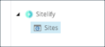
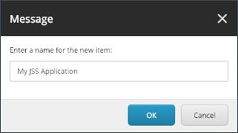
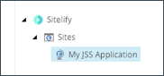
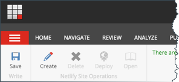
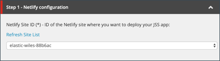
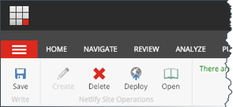
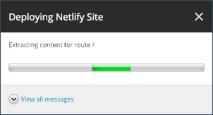
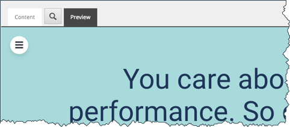

## Step 4.1 Create Sitelify site

Sitelify site is needed to configure the mapping of a JSS application to Netlify.

1. Log into your Sitecore content management (CM) instance.
1. From the launchpad open the Sitelify Manager application.

    

1. Navigate to `Sitelify > Sites`

    

1. Add a new item using the template `Site`.
1. Enter a name for the Sitelify site and click **OK**.

    

1. After the item is created, you will see it in the content tree.

    

## Step 4.2 Create Netlify site

In order to deploy a JSS application to Netlify, a site must exist in Netlify. 
A new Netlify site can be created using the Sitelify Manager application.

***Note:** If you already have a Netlify site that you want to deploy your JSS application to you can skip this step.*

1. Select your Sitelify site in the content tree.

    

1. In the ribbon, in the section for *Netlify Site Operations*, click **Create**.

    

1. It will take a moment for the site to be created in Netlify. You will know the site was created when the field *Netlify Site ID* is populated.

    

## Step 4.3 Configure Sitelify site

The purpose of the Sitelify site is to map information from a JSS application to a Netlify site.
The various fields on the Sitelify site item allow you to control this mapping.

Field name | Required | Description
--- | :---: | ---
Netlify Site ID | Yes | 
ID of the Netlify site where you want to deploy your JSS application.

This field is a dropdown list that contains the names of the Netlify sites available based on the Netlify access token that is set on your Sitecore server.

If you created the Netlify site from Sitecore, that Netlify site is selected automatically.

For performance reasons Sitelify only refreshes the list of sites from Netlify under select circumstances (for example, when a Netlify site is created or deleted from the Sitelify Manager). If a Netlify site is added or deleted from Netlify, it is possible for this list to get out of date. When this happens, use the link **Refresh Site List** to force Sitelify to refresh the list of sites from Netlify.

Route Root Item | Yes | 
Starting route-level item for your JSS application.

Dictionary Root Item | No | 
Location of the dictionary items for the JSS application.

Content Languages | Yes | 
Sitelify generates static pages from content in Sitecore. This field allows you to select which language(s) are included.

JSS App Name | Yes | 
Name of the JSS application you want to deploy to Netlify.

This field reads the JSS applications registered on the Sitecore server and displays them so you do not have to look through the Sitecore configuration manually.

Sitecore Site Name | Yes | 
Name of the Sitecore site that is associated with the JSS application selected in the field *JSS App Name*.  you want to deploy to Netlify.

This field reads the Sitecore sites registered on the Sitecore server and displays them so you do not have to look through the Sitecore configuration manually.

Sitecore API Key | Yes | 
API key that the JSS application is configured to use.

Sitecore Instance Host Name | No | 
Host name used for content extraction.

You should use the host name for your Sitecore content management server, or the host name that is assigned to the Sitecore site selected in the field *Sitecore Site Name*.

App Bundle Folder | No | 
Needed for JSS applications built using Angular.

## Step 4.4 Deploy JSS application

After you have configured all of the required fields on the Sitelify site item you are ready to deploy the JSS application to Netlify.

1. Select the Sitelify site
1. In the ribbon, in the section for *Netlify Site Operations*, click **Deploy**.

    

1. While Sitelify deploys the JSS application to Netlify, status messages are displayed.

    

1. When the deploy process is finished, the Netlify site is displayed in the *Preview* tab.

    

1. You can open the live site in Netlify using the *Open* button in the ribbon.

    

    ***Note:** Sitelify uses a popup window to open the site in Netlify. If you do not see a popup window after clicking the button, ensure your browser is not blocking popups from your Sitecore server and then try again.*

## Next steps

Now you are able to deploy your JSS application to your Netlify site. 
After you make changes to either the JSS application or the content, 
you must redeploy the site to Netlify.