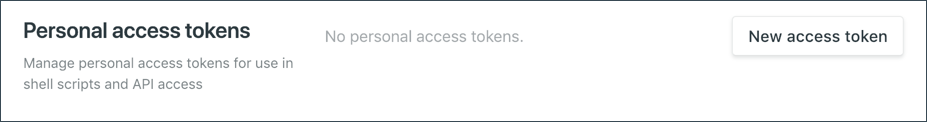
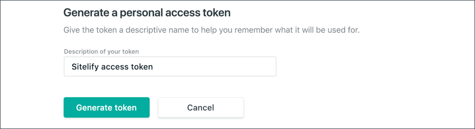
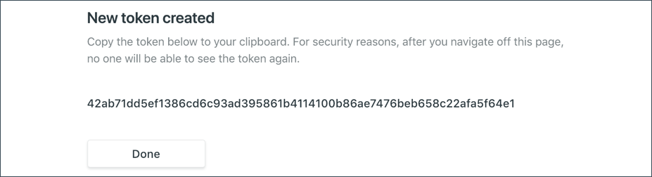

In order for Sitecore to connect to your Netlify account, a personal access token is needed.

1. Log into your Netlify account.
1. Navigate to `Account Settings > OAuth applications` 
1. Click **New access token**.

    

1. For the description of the token enter `Sitelify access token`.
1. Click **Generate token**.

    

1. Save the access token value in a file. You will need to add this value to your Sitecore server in a later step.

    

1. Click **Done**.

## Next steps

Now that you have the Netlify personal access token handy, let's proceed to installing the Sitelify module on the same Sitecore Content Management instance that is running your JSS app.
