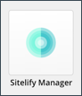

Sitelify is a module that is installed on your Sitecore server. This section guides you through the process of installing and configuring the Sitelify module.

## Prerequisites

Before you can start using Sitelify you must have the following:

Requirement | Description
--- | ---
Sitelify license | 
In order to use Sitelify you need a license.
 
You can request a license by completing the form on the [Sitelify site](https://sitelify.io/#request-access).

Sitelify installation package | 
Sitelify is installed on your Sitecore server using an installation package.

This package is provided along with your Sitelify license.

Netlify account | 
Sitelify supports all Netlify subscription levels, including the free tier.

You can create an account on the [Netlify site](https://www.netlify.com/).

Sitecore JSS application | 
Sitelify deploys JSS applications to Netlify. Therefore you must have a JSS application in order to use Sitelify.

The [JSS documentation](https://jss.sitecore.com/) provides detailed instructions on how to create one.

## Create personal access token

In order for Sitecore to connect to your Netlify account, a personal access token is needed.

1. Log into your Netlify account.
1. Navigate to `Account Settings > OAuth applications` 
1. Click **New access token**.

    

1. For the description of the token enter `Sitelify access token`.
1. Click **Generate token**.

    

1. Save the access token value in a file. You will need to add this value to your Sitecore server in a later step.

    

1. Click **Done**.

## Install package

Sitelify is installed on your Sitecore server using an installation package.

1. Log into your Sitecore content management (CM) instance as an administrator.
1. Navigate to `Control Panel > Install a package`
1. Upload and install the Sitelify installation package.
1. After the package is installed you will see a new icon in the Sitecore launchpad.

    

## Configure module

When the module is installed, a new config file is added to your Sitecore server. 
This file contains settings that must be configured before the Sitelify can be used.

The settings below are defined in the following config file:

`[Sitecore CM root folder]\App_Config\Include\Altola.Sitelify\Altola.Sitelify.config`

Setting | Value
--- | ---
`Sitelify.LicenseKey` | Sitelify license key provided to you from Altola.
`Sitelify.NetlifyAccessToken` | Netlify access token you created in the section [Create personal access token](#create-personal-access-token).

## Next steps

Now that the Sitelify module is installed on your Sitecore server, you can configure Sitelify to deploy your JSS application to Netlify.