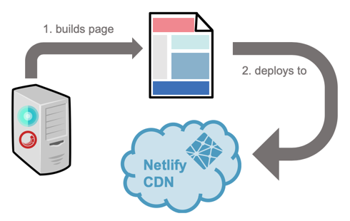
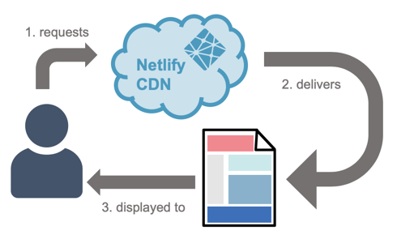
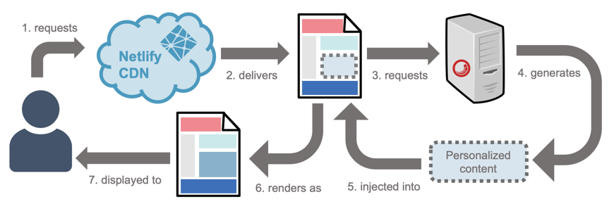

Sitelify helps you get the fastest performance from your Sitecore servers.

## Why Sitelify?

Sitelify was designed to address several common complaints from customers using Sitecore to deliver their sites.

* **My site takes too long to load.** By using Netlify's global content delivery network (CDN) to deliver your site, your site is always close to your visitors, anywhere in the world they are located.
* **My Sitecore server cannot handle as much traffic as I expected.** By removing the need for Sitecore to build pages at runtime, the load on Sitecore is significantly reduced. This means you can support more visitors with your existing Sitecore investment.

## Deployment process

With Sitelify, Netlify is able to handle most - if not all - of the web page delivery process that Sitecore content delivery servers traditionally handle. This works by Sitelify using Sitecore to generate the site and then deploying the resulting files to Netlify.

## Page delivery process

When a visitor requests a page from your site, Netlify handles the request. Since the Sitecore site was deployed to Netlify, all of the files that are needed are available on Netlify.

When personalization is added the page delivery process becomes more complex because the personalized content must be retrieved and injected into the page.

## Features

Sitelify was built for one thing and to do that one thing very well: simplifying the process of deploying Sitecore web sites to Netlify.

* **Easy to install** - You can install Sitelify in minutes. Want proof? Watch us install and configure Sitelify, and then deploy a Sitecore site to Netlify <a href="https://www.youtube.com/watch?v=xdhbtKMSnO4" target="_blank">in under 5 minutes</a>.
* **Native configuration experience** - Sitelify Manager is a native Sitecore application that lets you configure and control all aspects of the integration between Sitecore and Netlify.
* **Support for all JSS-compatible versions of Sitecore** - If you can run JSS on a version of Sitecore, you can run Sitelify.
* **Support for all Netlify subscription levels** - Sitelify works with all Netlify subscriptions, from free to enterprise.
* **Personalization** - Sitelify lets you leverage a CDN for fast delivery without losing the ability to deliver Sitecore-generated personalized content to your visitors.